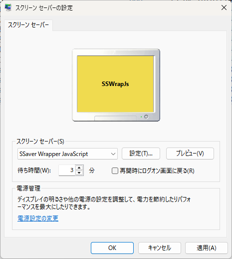
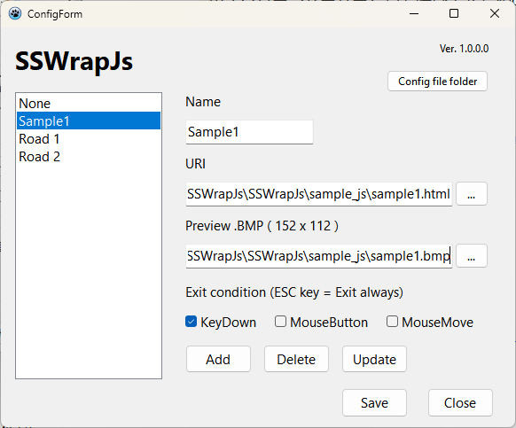

<!-- -*- encoding: utf-8 -*- -->

SSWrapJS
========

ブラウザ上で表示できる HTML + JavaScript をWindows用スクリーンセーバーとして呼び出すためのラッパー。Lazarus 4.4 で作成。

Description / 説明
------------------

以下の条件を満たす HTML + JavaScript を、Windows用スクリーンセーバ相当として利用できる。

* ブラウザの画面全体に何かを表示するHTML + JavaScript

Screenshots / スクリーンショット
--------------------------------

Requirement / 依存関係
----------------------

* 64bit版 Windows にのみ対応。32bit版には未対応。
* Microsoft Edge がインストールされていること。
* Lazarus 4.4 を使用して作成。
* ビルドするには [WebView4Delphi](https://github.com/salvadordf/WebView4Delphi) が必要。

マルチディスプレイには未対応。

Environment / 動作確認環境
--------------------------

Windows11 x64 25H2 上でのみ動作確認しました。

Windows10 で動かすには Microsoft Edge のインストールと WebView2Loader.dll が必要になりそうですが、試していません。

Install / インストール方法
--------------------------

1. Releasesページからzipを入手して解凍。
2. SSWrapJs.scr が入っているので C:/Windows/System32/ 以下にコピー。

64bit版Windowsのみに対応。32bit版Windowsには未対応。

Uninstall / アンインストール方法
--------------------------------

* C:/Windows/System32/SSWrapJs.scr を削除。
* 設定ファイルとキャッシュフォルダ C:/Users/(USERNAME)/AppData/Local/SSWrapJs/ を削除。

Usage / 使い方
--------------

1. 「スクリーンセーバーの変更」を表示。
2. リストから「SSaver Wrapper JavaScript」を選ぶ。
3. 「設定」ボタンをクリック。呼び出したいHTMLを指定できる設定ダイアログが表示される。
4. 各テキストボックスに、管理名、呼び出したいURI または ローカルの .html のファイルパスを入力する。
   *  プレビュー画面用のbmp画像 (152 x 112) は指定してもしなくても構わない。指定すればプレビュー画面にそのbmp画像が表示される。
5. スクリーンセーバを終了させる条件を設定。
   * KeyDown : キーの押し下げで終了。
   * MouseDown : マウスの左ボタンクリックで終了。
   * MouseMove : マウスを動かすと終了。
   * 上記3つがオフでも、ESCキー押しで終了できる。
6. 「Add」もしくは「Update」をクリックして登録。
7. 「Save」をクリックして設定を終了。この時選ばれている項目がスクリーンセーバとして呼び出される。

### 設定ダイアログのボタンについて

* Add : リストに追加登録。
* Delete : リスト上で選択中の項目を削除。
* Update : リスト上で選択中の項目をテキストボックスの内容で更新。
* Save : リスト上で選択した項目が呼び出されるよう、設定が保存される。
* Close : 設定ダイアログを閉じる。「Save」が押されない限り、設定の保存はしない。

### 入力例

#### Web上にあるHTMLの場合

* Name : Sample 1
* URI : http://blawat2015.no-ip.com/~mieki256/diary/img/20160502_threejs_06/roadmake4.html

#### ローカルにあるHTMLの場合

* Name : Sample 2
* URI : C:\hoge\fuga\piyp\index.html

License / ライセンス
--------------------

WebView4Delphi に頼った作りなので、WebView4Delphi のライセンスに従いたいと思います。

Author / 作者名
---------------

[mieki256](https://github.com/mieki256)

